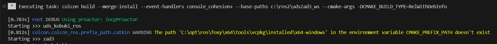
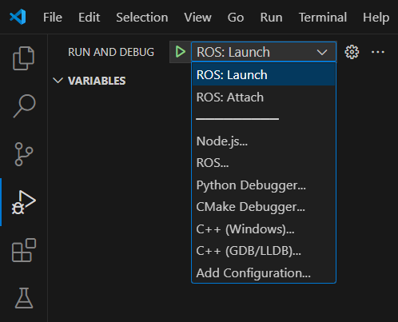

# VSCode setup pre ROS2 C++ programovanie

Návod predpokladá, že máte nainštalovaný ROS2 Foxy podľa https://github.com/stecf/uds_kobuki_ros. 

Vysoko odporúčam, aby ste si svoj **ros_ws** vytvorili na takom umiestnení a s takým názvom, ktoré neobsahuje medzery, ani žiadne špeciálne znaky. Vývojové nástroje majú bežne problém pracovať s takýmito cestami. 

## Inštalácia a spúšťanie VSCode

Všeobecne odporúčam inštalovať systémový variant VSCode (na stránke VSCode pomenovaný **System Installer**), ktorý sa inštaluje do systémových priečinkov (Program Files) nie do užívateľských priečinkov (%AppData%). **Link na stiahnutie System Installeru**: https://code.visualstudio.com/docs/?dv=win64.

Tiež všeobecne odporúčam VSCode spúšťať z konzoli v ktorej bol sourcnutý ROS2. Toto môžete spraviť príkazom:

```bash
code
```
Alebo si môžete vyrobiť skript založený na mojich sourcovacích skriptoch

```bat
@echo off

rem Initialize console with Visual Studio environment and source ROS2
call %~dp0\ros2init.bat 
rem Run VSCode
call code
```

## VSCode Extensions

Pre programovanie, buildovanie a debug ROS2 C++ sú odporúčané nasledovné rozšírenia:

- [ROS](https://marketplace.visualstudio.com/items?itemName=ms-iot.vscode-ros) with Dependacies:
    - [Python](https://marketplace.visualstudio.com/items?itemName=ms-python.python)
    - [C/C++](https://marketplace.visualstudio.com/items?itemName=ms-vscode.cpptools)
- [C/C++ Extension Pack](https://marketplace.visualstudio.com/items?itemName=ms-vscode.cpptools-extension-pack)
- [CMake](https://marketplace.visualstudio.com/items?itemName=twxs.cmake) (Optional)

## [Otvorenie projektu / workspace](https://picknik.ai/vscode/docker/ros2/2024/01/23/ROS2-and-VSCode.html)

Projekt / workspace stačí otvoriť ako **"Open Folder"** v koreni workspace. Štandardne má workspace priečinok sufix **"_ws"**, práve tento priečinok je potrebné otvoriť.

Ak chcete používať integrovanú konzolu VSCode na spúšťanie ROS2 príkazov upravte svoj **settings.json**, ktorý sa nachádza v **%AppData%\\Roaming\\Code\\User\\settings.json**. Do *"terminal.integrated.profiles.windows":* môžete pridať **profil ros2cmd**:
```json
"ros2cmd": {
    "path": [
        "${env:windir}\\Sysnative\\cmd.exe",
        "${env:windir}\\System32\\cmd.exe"
    ],
    "args": [
        "/d",
        "/k", 
        "C:\\ros2\\ros2console"] // Toto je môj sourcovací skript ktorý nájdete v tomto repozitári aj s jeho dependanciami. 
        // VYSOKO ODPORÚČAM POUŽIŤ MOJ SKRIPT a netinkerovať podľa seba je to dosť bádania a iné riešenia nemám overené.
        // Namiesto môjho skriptu môžete použiť kombináciu príkazov
        //     call "%ProgramFiles(x86)%\Microsoft Visual Studio\%VSVersion%\Community\VC\Auxiliary\Build\vcvars64.bat" 
        //         Kde je potrebné zmeniť %VSVersion% za vašu verziu VS
        //     call c:\opt\ros\foxy\x64\setup.bat
        //     call c:\opt\install\setup.bat
}
```
Ak **settings.json** nenájdete na vyššie uvedenom umiestnení postupujte takto, vo VSCode otvorte nastavenia **(Ctrl+,)** a vyhľadajte **terminal.integrated.profiles.windows**. Potom kliknite na **Edit in settings.json**.
```
terminal.integrated.profiles.windows
```


Teraz by ste mali byť schopní spustiť sourcnutý ros2 command line v integrovanom termináli VSCode


## [Colcon Build vo VSCode](https://picknik.ai/vscode/docker/ros2/2024/01/23/ROS2-and-VSCode.html)

Po nainštalovaní rozšírenia ROS by mal byť automaticky vytvorený task, na buildovanie ROS package-ov. Tento task by mal stačiť pre buildovanie a spúšťanie package-ov, pokiaľ však chcete kód debugoať nemusí to byť dostatočné. Spustiť ho je možné cez **Terminal -> Run Build Task -> colcon: build**. V termináli sa postupne objaví:




Presne preto je možné si zadefinovať vlastné task-y. V koreni workspace by sa mal nachádzať priečinok **.vscode** v ňom môžete vytvoriť **tasks.json**, ktorého prázdna štruktúra by mala vyzerať takto:
```json
{
  "version": "2.0.0",
  "tasks": [

  ]
}
```
Do políčka tasks je možné pridávať rôzne task-y, nie len na buildovanie, ale aj na vyčistenie workspace, testovanie atď. viaceré tasky si môžete pozrieť [tu: How to build with Colcon](https://picknik.ai/vscode/docker/ros2/2024/01/23/ROS2-and-VSCode.html). Najzákladnejší debug build task môže vyzerať takto:
```json
{
    "label": "colcon: build (debug)",
    "type": "shell",
    "command": [
        "colcon build",
        "--symlink-install --merge-install ",
        "--event-handlers console_cohesion+",
        "--base-paths workspace-path",
        "--cmake-args -DCMAKE_BUILD_TYPE=Debug" // Neoptimalizovaný kód - "Debug riadok po riadku"
        //-DCMAKE_BUILD_TYPE=RelWithDebInfo  // Optimalizovaný kód - "Symbolický debug - Nie do úplnej hĺbky"
    ]
}
```
Custom Task-y je možné spúšťať cez **Terminal -> Run Task -> "Task Name"**.

Dôležité je tiež pravidelne meniť a dopĺňať svoje CMakeList.txt a package.xml. Tu je ukážka ako vyzerá môj CMake a package.xml:

### CMake file

```cmake
cmake_minimum_required(VERSION 3.5)
project(zad3)

#####################################################
## C++ Uga Buga Cave Man Brain ## Default to C++14 ##
#####################################################
if(NOT CMAKE_CXX_STANDARD)
    set(CMAKE_CXX_STANDARD 14)
endif()

if(CMAKE_COMPILER_IS_GNUCXX OR CMAKE_CXX_COMPILER_ID MATCHES "Clang")
    add_compile_options(-Wall -Wextra -Wpedantic)
endif()

###############################################
## Ament package manager - Find all PACKAGES ##
###############################################
find_package(ament_cmake REQUIRED)
find_package(rclcpp REQUIRED)
find_package(sensor_msgs REQUIRED)
find_package(geometry_msgs REQUIRED)

##############################
## Define all INCLUDE PATHS ##
##############################
include_directories(
    include
    include/zad3
    include/zad3/teleop
    include/zad3/lidar
)

###############################
## Declare a C++ EXECUTABLES ##
###############################
add_executable(teleop_cli_node
    src/teleop/teleop_node.cpp
    src/teleop/teleop_cli.cpp
)
add_executable(lidar_node
    src/lidar/lidar_node.cpp
    src/lidar/lidar.cpp
)

######################################################################
## Specify libraries to link a library or executable target against ##
######################################################################
ament_target_dependencies(teleop_cli_node
    rclcpp
    geometry_msgs
)
ament_target_dependencies(lidar_node
    rclcpp
    sensor_msgs
)

#############
## Install ##
#############
install(TARGETS
    teleop_cli_node
    lidar_node
    DESTINATION lib/${PROJECT_NAME})

ament_package()
```
### Package.xml file

```xml
<?xml version="1.0"?>
<?xml-model href="http://download.ros.org/schema/package_format3.xsd" schematypens="http://www.w3.org/2001/XMLSchema"?>
<package format="3">
  <name>zad3</name>
  <version>0.0.0</version>
  <description>TODO: Package description</description>
  <maintainer email="marcopolo1234565@gmail.com">MarekS</maintainer>
  <license>TODO: License declaration</license>

  <depend>rclcpp</depend>
  <depend>sensor_msgs</depend>
  <depend>geometry_msgs</depend>

  <buildtool_depend>ament_cmake</buildtool_depend>

  <test_depend>ament_lint_auto</test_depend>
  <test_depend>ament_lint_common</test_depend>

  <export>
    <build_type>ament_cmake</build_type>
  </export>
</package>

```

## [Programovanie C++ ROS2 v VSCode (aneb InteliSense)](https://picknik.ai/vscode/docker/ros2/2024/01/23/ROS2-and-VSCode.html)

Keď otvoríte ROS2 projekt vo VSCode v priečinku **.vscode** by mali tiež vzniknúť súbory **c_cpp_properties.json** a **settings.json**. Slúžia hlavne na konfiguráciu dopĺňania a zvýrazňovania kódu, mali by vyzerať nasledovne (špecificky podľa zariadenia a workspacu):
```json
settings.json
{
    "ros.distro": "foxy",
    "python.autoComplete.extraPaths": [
        "c:\\ros2\\udsZad3_ws\\install\\Lib\\site-packages",
        "C:\\opt\\ros\\foxy\\x64\\Lib\\site-packages",
        "C:\\ros2\\udsZad3_ws\\build\\uds_kobuki_ros",
        "c:\\opt\\install\\Lib\\site-packages",
        "C:\\ros2\\udsZad3_ws\\install\\Lib\\site-packages",
        "c:\\opt\\ros\\foxy\\x64\\Lib\\site-packages"
    ],
    "python.analysis.extraPaths": [
        "c:\\ros2\\udsZad3_ws\\install\\Lib\\site-packages",
        "C:\\opt\\ros\\foxy\\x64\\Lib\\site-packages",
        "C:\\ros2\\udsZad3_ws\\build\\uds_kobuki_ros",
        "c:\\opt\\install\\Lib\\site-packages",
        "C:\\ros2\\udsZad3_ws\\install\\Lib\\site-packages",
        "c:\\opt\\ros\\foxy\\x64\\Lib\\site-packages"
    ],
    "files.associations": {
        "memory": "cpp",
        "xlocale": "cpp",
        "xlocinfo": "cpp",
        "xstring": "cpp"
    }
}
```
```json
c_cpp_properties.json
{
  "configurations": [
    {
      "browse": {
        "databaseFilename": "${default}",
        "limitSymbolsToIncludedHeaders": false
      },
      "includePath": [
        "C:\\opt\\ros\\foxy\\x64\\include\\**",
        "c:\\opt\\ros\\foxy\\x64\\include\\**",
        "c:\\ros2\\udsZad3_ws\\src\\uds_test\\include\\**"
        // ${workspaceFolder}/build/package // Pre doplnenie vlastných include ciest
      ],
      "name": "ROS",
      "intelliSenseMode": "msvc-x64",
      "cStandard": "c11",
      "cppStandard": "c++14"
    }
  ],
  "version": 4
}
```

## Debugovanie C++ ROS2 cez VSCode

V priečinku **.vscode** je potrebné vytvoriť **launch.json**, ktorého prázdna štruktúra vyzerá nasledovne:
```json
{
    "version": "0.2.0",
    "configurations": [

    ]
}
```
V poli configurations je možné pridávať viaceré konfigurácie (oddelené čiarkou) debuggera, ktoré sú popísané nižšie.

Debugger sa potom spúšťa cez **Run and Debug** špecificky podľa zvolenej konfigurácie.


### [(**Attach** Debugger) Pripojenie debuggera k bežiacemu kódu](https://picknik.ai/vscode/docker/ros2/2024/01/23/ROS2-and-VSCode.html)

Pripojí debugger k už bežiacej node, ktorá musí byť spustená pred spustením debuggera, konfigurácia pre **launch.json** vyzerá nasledovne:
```json
{
    "name": "ROS: Attach",
    "request": "attach",
    "type": "ros"
}
```
Pri spúšťaní je potrebné do kontextového okna napísať názov executable na ktorý sa má debugger pripojiť.

### (**Launch** Debugger) Spusti debugger zároveň s kódom

Zároveň spustí kód aj debugger, konfigurácia pre **launch.json** vyzerá nasledovne:
```json
{
    "name": "ROS: Launch",
    "type": "ros",
    "request": "launch",
    "target": "C:\\ros2\\udsZad3_ws\\src\\zad3\\launch\\zad3_launch.py" // Alebo jedna Node.exe
}
```
Návod ako vytvárať launch.py sa nachádza tu: https://docs.ros.org/en/foxy/Tutorials/Intermediate/Launch/Creating-Launch-Files.html Ukážka môjho Launch File je tu:
```python
// contents of file zad3_launch.py
from launch import LaunchDescription
from launch_ros.actions import Node

def generate_launch_description():
    return LaunchDescription([
        Node(
            package='zad3',
            namespace='zad3',
            executable='teleop_cli_node',
            name='teleop_cli_node'
        ),
        Node(
            package='zad3',
            namespace='zad3',
            executable='lidar_node',
            name='lidar_node'
        ),
    ])
```
